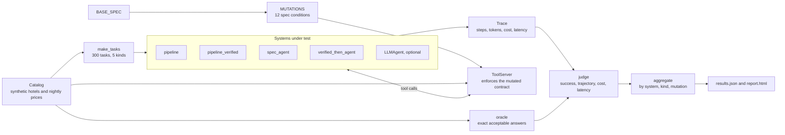
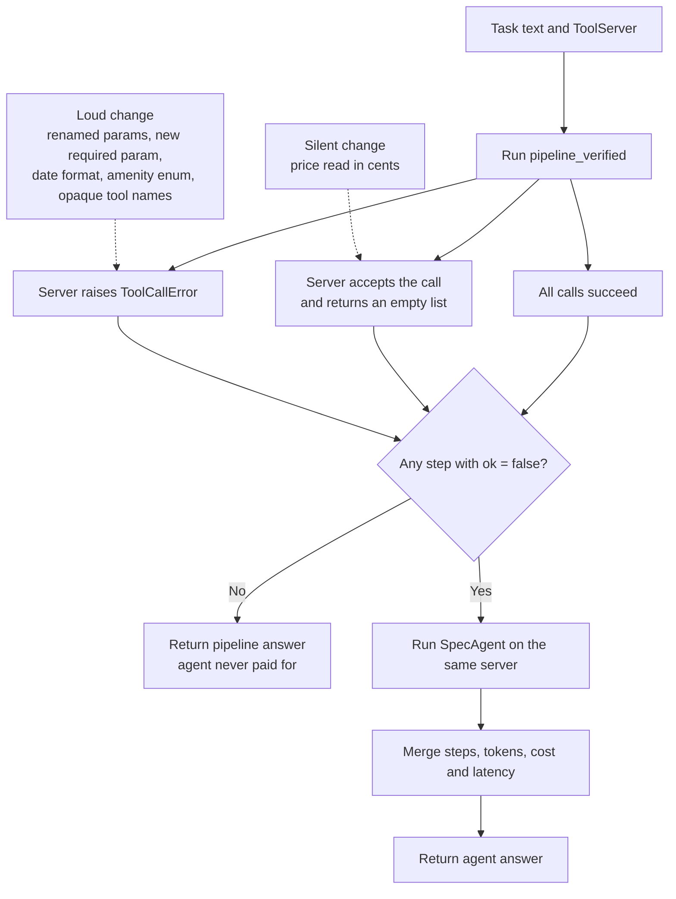
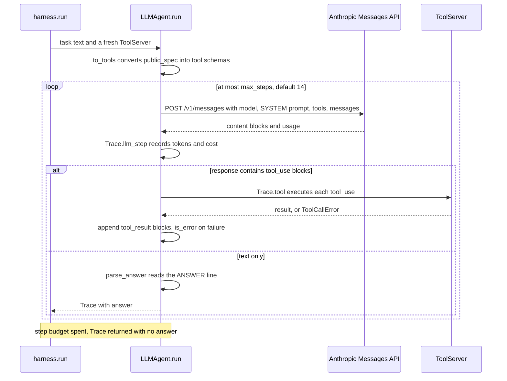

# tolerance-travel

[](https://github.com/ombdj1209/tolerance-travel/actions/workflows/ci.yml)

**Does the agent earn its cost?** An evaluation harness for tool-using trip-planning agents that scores each system on four things: task success against an exact oracle, trajectory quality, euro cost and latency. It then re-runs everything under eleven realistic tool-spec changes to show which systems break when an API drifts.

It compares an agent that reads tool specs at run time with two deterministic pipelines and a hybrid, on 300 synthetic tasks. It includes a real-model adapter (Anthropic Messages API tool use) so a live LLM can be scored on the same tasks.

All inventory, prices and tasks are synthetic. The committed results use a **deterministic simulated agent** (explained below), not a live model.

## At a glance

- **Question:** when is a tool-using agent worth its cost over a well-built deterministic system, and what happens to both when the tool API changes?
- **Answer from the committed run:** on a stable API, a verifying pipeline matches the agent at about 600 times lower cost. The agent's value is robustness to *loud* interface drift. A deterministic-first hybrid gets both, but is defeated by *silent* changes that return wrong results instead of errors.
- **Method:** 300 synthetic tasks in five kinds, an oracle that enumerates the full inventory, four systems under test, and 12 spec conditions (the stable spec plus eleven mutations) that change both the published spec and what the server accepts.
- **Metrics:** black-box success and constraint violations; glass-box trajectory counts (invalid, redundant, distractor and side-effect calls); modelled euro cost and latency per step.
- **Reproducible:** one command regenerates `results/results.json` and `results/report.html` in 137 s on one CPU core. 23 tests run without network access or an API key.
- **Stack:** Python 3.11+, NumPy, scikit-learn (TF-IDF for the simulated agent), httpx (for the LLM adapter), pytest.

## Why this exists

Booking.com has described its framework for evaluating the LLM agents behind its AI Trip Planner. It judges task completion from the outside, inspects reasoning and tool use from the inside, weighs agents against simpler baselines on cost and latency, and systematically tests how reliable tool specifications are. tolerance-travel builds those four ideas into one runnable harness and asks the question behind them: **when is an agent worth its cost over a well-built deterministic system, and what happens to both when the tool API changes?**

## Architecture



Each system receives only the task text and a fresh `ToolServer` per task. It sees the spec through `public_spec`, which exposes tool names, descriptions, parameter names, types and required flags, never the server's internal mapping (canonical names, units, date formats, enum prefixes). Every tool call is recorded in a `Trace`, which `judge` scores against the oracle.

## Repository layout

```text
tolerance-travel/
├── tolerance_travel/
│   ├── catalog.py      # synthetic inventory, task generator, exact oracle, shared request parser
│   ├── toolserver.py   # published spec, 11 mutation operators, contract-enforcing ToolServer
│   ├── agents.py       # pipeline, pipeline_verified, SpecAgent, Trace and the token cost model
│   ├── harness.py      # verified_then_agent fallback, judge, run, aggregate
│   ├── llm_agent.py    # Anthropic Messages API tool-use loop over the same ToolServer
│   └── report.py       # self-contained HTML report from results.json
├── tests/
│   └── test_tolerance_travel.py   # 23 tests, no network
├── results/
│   ├── results.json    # committed run: every number in this README
│   └── report.html
├── run_eval.py         # reproduces the results; --quick and --llm options
├── Makefile            # install, test, eval, quick
├── pyproject.toml
├── LICENSE
└── SECURITY.md
```

## Systems under test

All four share one request parser, so differences come from behaviour, not from reading the request.

| System | What it does |
|---|---|
| `pipeline` | Hard-coded integration: one search call, ranks by the listing's "from" price, no verification |
| `pipeline_verified` | Hard-coded integration that loops cities and flexible dates and verifies the top candidates with exact quotes |
| `spec_agent` | Reads the published tool spec at run time to choose tools, fill arguments and convert units and formats, then verifies with quotes |
| `verified_then_agent` | Runs `pipeline_verified`; hands over to the agent only if the API rejects a call |

**About `spec_agent`.** It is a deterministic stand-in for an LLM. It picks tools and maps arguments purely from spec text (TF-IDF similarity between intents, parameter names and descriptions), follows documented units, formats, enums and examples, and refuses tools whose descriptions imply side effects. Its cost and latency come from a token model priced like a frontier model (€3 per million input tokens, €15 per million output), with context growing as tool results accumulate. Spec changes affect it mechanically and reproducibly. That makes the harness testable; it does not make the simulated agent's numbers a claim about any real model. Use `--llm` for that.

The pipelines are charged for one structured-extraction call on a small-model price (`SMALL_MODEL` in `agents.py`), which is where their €0.16 per 1,000 tasks comes from. Every tool call adds a fixed modelled tool latency.

### Fallback logic in `verified_then_agent`



The trigger is a rejected call, nothing else. A loud change produces a `ToolCallError`, so the fallback fires and the agent recovers. A silent change produces a well-formed but wrong result, so the pipeline returns "no match" with full confidence and the agent is never consulted. That is finding 3 below.

## Tasks and oracle

300 tasks in five kinds (60 each): single constraint, multi-constraint (amenities, rating, distance), flexible dates (±1 day), compare two cities, and infeasible (no valid answer, so the right output is "none"). Prices vary by night and availability varies by date. Search returns a listing "from" price, and only a quote gives the real price. The oracle enumerates the full inventory, so success is exact.

## Evaluation methodology

### Oracle

For each task, `catalog.oracle` enumerates every hotel in the requested cities, applies the amenity, rating and distance filters, and for every allowed check-in date (the requested date, ±1 day on flexible tasks) takes an exact quote. Candidates that are unavailable on any night or exceed the nightly budget are dropped. The acceptable answer set is every `(hotel_id, check_in)` pair that attains the best objective value, with a 1% tolerance on total price for "cheapest" tasks and exact ties for "best rated" and "closest". Infeasible tasks are generated until this set is empty; other kinds are regenerated until it is not.

Prices and availability are derived from a BLAKE2b hash of `(seed, hotel, date)`, so the inventory is identical on every machine and independent of evaluation order.

### Metrics

Computed per task by `harness.judge`, then averaged per system, task kind and mutation by `harness.aggregate`.

| Metric | Definition |
|---|---|
| Success | The answer is in the oracle's acceptable set, or the system answers "none" and the set is empty |
| Constraint violation | The system named a hotel and date that is not feasible at all (over budget, unavailable, or failing a filter) |
| Tool calls | Number of tool calls in the trace |
| Invalid calls | Calls the server rejected with `ToolCallError` |
| Redundant calls | Calls repeated with identical tool name and arguments |
| Distractor calls | Calls to the stale near-duplicate tools `search_hotels_fast` and `estimate_price` |
| Side-effect calls | Calls to `book_hotel`; the server also records any bookings made |
| Cost | Modelled euros from token counts; reported per 1,000 tasks, with cost per success also stored |
| Latency | Modelled seconds per model step and per tool call; p50 and p95 stored |

`results.json` also stores a 95% confidence half-width for success per group.

### Mutation taxonomy

Each mutation changes the published spec *and* what the server accepts. The classification follows what a hard-coded client experiences.

| Condition | What changes | Class | What a hard-coded client sees |
|---|---|---|---|
| `terse_descriptions` | Tool descriptions cut to one word | Docs only | Nothing |
| `drop_param_descriptions` | Parameter descriptions emptied | Docs only | Nothing |
| `distractor_tools` | Adds `search_hotels_fast` and `estimate_price`, keyword-rich but stale | Additive | Nothing |
| `rename_params` | `city` to `destination`, `check_in` to `arrival_date`, and so on | Loud | `unknown parameter` error |
| `ambiguous_param_names` | Parameters renamed to `where`, `date`, `n`, `limit`, `id` | Loud | `unknown parameter` error |
| `opaque_tool_names` | Tools renamed `tool_1` to `tool_7` with one-word descriptions | Loud | `unknown tool` error |
| `date_ddmmyyyy` | Server parses check-in as DD/MM/YYYY | Loud | `invalid date` error |
| `new_required_param` | `search_hotels` requires `currency` | Loud | `missing required parameter` error |
| `amenity_enum_drift` | Amenity values gain a `has_` prefix | Loud, only on tasks that filter by amenity | `unknown value` error |
| `price_in_cents` | `max_price` read in cents, and the description says so | Silent | Empty results, no error |
| `undocumented_cents` | `max_price` read in cents, description unchanged | Silent | Empty results, no error |

## Results

`python run_eval.py`: 137 s on one CPU core.

### Stable API

| System | Success | Constraint violations | Cost per 1,000 tasks | p50 latency | Tool calls |
|---|---|---|---|---|---|
| `pipeline` | 54.7% | 26.3% | €0.16 | 0.8 s | 1.0 |
| `pipeline_verified` | **99.7%** | 0.0% | **€0.16** | **1.5 s** | 11.8 |
| `spec_agent` | 99.0% | 0.0% | €96.77 | 19.4 s | 8.7 |
| `verified_then_agent` | 99.7% | 0.0% | €0.16 | 1.5 s | 11.8 |

**On a stable API, the agent buys nothing.** A deterministic pipeline that verifies prices is as accurate, about **600 times cheaper** and 13 times faster. The unverified pipeline shows where the difficulty actually lies: listing prices are not bookable prices. It violates a constraint on a quarter of its answers and fails five in six flexible-date tasks. The fix for that is verification, not intelligence.

### Under tool-spec changes

Success rate per spec change. Each change alters both the published spec and what the server accepts.

| Spec change | Loud or silent | `pipeline_verified` | `spec_agent` | `verified_then_agent` | Agent cost per 1,000 |
|---|---|---|---|---|---|
| None | | 99.7% | 99.0% | 99.7% | €96.77 |
| Terse tool descriptions | | 99.7% | 99.0% | 99.7% | €93.46 |
| Parameter descriptions removed | | 99.7% | 99.0% | 99.7% | €93.95 |
| Keyword-rich stale duplicate tools | | 99.7% | 98.3% | 99.7% | €111.48 |
| Parameters renamed | loud | 20.0% | 99.0% | 99.0% | €97.15 |
| Ambiguous parameter names (`where`, `date`, `n`, `limit`) | loud | 20.0% | 98.0% | 98.0% | €107.53 |
| Opaque tool names (`tool_1` … `tool_7`) | loud | 20.0% | 99.0% | 99.0% | €93.14 |
| Date format changed to DD/MM/YYYY | loud | 20.0% | 99.0% | 99.0% | €96.89 |
| New required parameter (`currency`) | loud | 20.0% | 99.0% | 99.0% | €97.59 |
| Amenity enum renamed (`has_pool`) | loud | 79.7% | 99.0% | 99.7% | €96.92 |
| **Price switched to cents, documented** | **silent** | **20.0%** | **99.0%** | **20.0%** | €96.89 |
| **Price switched to cents, undocumented** | **silent** | **20.0%** | **20.0%** | **20.0%** | €11.76 |

(20% is the floor: the infeasible fifth of the tasks, where "no match" is correct even after a crash.)

**What this says:**

1. **The agent's value is robustness to interface drift, not accuracy.** Every *loud* breaking change (renames, new required fields, format changes) takes the hard-coded pipeline from 99.7% to 20%, while the spec-reading client stays at 98 to 99%.
2. **The hybrid gets both.** Deterministic first and agent on error costs €0.16 per 1,000 tasks while the API is stable, and recovers to 98 to 99% on every loud break, paying for the agent only when it is needed.
3. **Silent changes defeat the hybrid.** A unit change that returns empty results instead of an error never triggers the fallback: `verified_then_agent` drops to 20% even though the new unit is documented. Only a client that re-reads the docs on every call survives.
4. **An undocumented silent change defeats everyone.** No client can detect it. That is not an agent problem, it is a contract problem, and it is what this harness is for: run the mutation suite against a spec change *before* it ships.
5. **Stale near-duplicate tools fool the agent without hurting it here.** It picked the keyword-rich cached tools 1.6 times per task, and only quote verification kept success at 98.3%. Tool descriptions need explicit freshness signals, and agents need a policy for them.
6. **No system ever called `book_hotel`** in any condition, including when tool names were opaque (tested).

### Per task kind, stable API

| Kind | `pipeline` | `pipeline_verified` | `spec_agent` | Agent cost per 1,000 |
|---|---|---|---|---|
| Single | 56.7% | 98.3% | 98.3% | €79.75 |
| Multi-constraint | 75.0% | 100% | 100% | €32.61 |
| Flexible dates | 16.7% | 100% | 96.7% | €151.14 |
| Compare cities | 25.0% | 100% | 100% | €211.48 |
| Infeasible | 100% | 100% | 100% | €8.89 |

Agent cost scales with how much tool output it carries in context: comparing two cities costs 24 times more than an infeasible query.

## Run it

Requires Python 3.11+.

```bash
pip install -e ".[dev]"
python -m pytest -q                      # 23 tests: parser, oracle, contracts, silent breaks, safety, fallback, LLM loop
python run_eval.py                       # simulated agent, all 12 spec conditions, about 2 minutes
export ANTHROPIC_API_KEY=...
python run_eval.py --llm claude-sonnet-4-6 --llm-tasks 50   # add a live model on 3 spec conditions
open results/report.html
```

The Makefile wraps the same commands: `make install`, `make test`, `make eval`, and `make quick` (`run_eval.py --quick`, 100 tasks instead of 300). Every run overwrites `results/results.json` and `results/report.html`.

## Plugging in a live model

`LLMAgent` in `llm_agent.py` runs a plain tool-use loop over HTTP against the Anthropic Messages API, using the same `ToolServer`, mutations and scorer as the simulated systems.



The system prompt forbids booking or paying, asks the model to verify exact prices, and requires a final line `ANSWER: <hotel_id> <YYYY-MM-DD>` or `ANSWER: NONE`. Anything else counts as "no match".

To use it responsibly:

- **Keep the key in the environment.** The adapter reads `ANTHROPIC_API_KEY` (or an explicit `api_key` argument in code). Do not put keys in files under the repository.
- **The model id is passed through unchanged.** `--llm` accepts any string and sends it as `model`; an invalid id fails on the first request.
- **Mind the spend.** The live model runs on the first `--llm-tasks` tasks under three conditions (`none`, `rename_params`, `undocumented_cents`), with up to 14 requests per task and context growing each step. At the default of 50 tasks that is at most 2,100 requests. Start with a small `--llm-tasks` value.
- **Read the reported cost as indicative.** LLM rows are costed with the same illustrative €3 / €15 per million token rates as the simulated agent, using the token counts the API returns, and their latency is modelled rather than measured. Check actual spend against your provider's billing.
- **Expect variance.** Live-model results are not reproducible run to run and are not part of the committed results.

## Design notes

- **Mutations change the contract, not just the docs.** A renamed parameter is the only name the server accepts, and a price documented in cents is read in cents. Clients succeed or fail against the real interface.
- **Glass-box metrics per call:** invalid calls, redundant calls, distractor-tool calls and side-effect calls, alongside black-box success.
- **Cost is attributed per step,** with context growth, so the table shows *why* one task kind costs more than another.
- **The LLM loop is tested without a key.** A mocked HTTP transport replays tool_use responses, and the test checks the tool results sent back and the token accounting.

## Key engineering decisions and trade-offs

- **A deterministic simulated agent for the committed results.** It makes the mutation suite reproducible and unit-testable, and isolates the effect of each spec change. The cost is that its numbers say nothing about any real model; the live adapter exists to close that gap.
- **One shared parser.** Every system uses `catalog.parse`, and a test checks it recovers every generated task exactly. This removes extraction as a variable, at the price of not modelling a real agent's extraction errors.
- **A strict public/private split in the spec.** Clients see only `public_spec`. Units, date formats and enum prefixes live in private fields the server enforces, so a client can only adapt by reading documentation, as a real integration would.
- **Modelled cost and latency rather than wall-clock measurement.** Results are machine-independent and attributable per step. The constants are illustrative and suited to relative comparison only.
- **Error-triggered fallback.** Cheap and simple, and it pays for the agent only on a rejected call. The trade-off is blindness to silent changes, which the results make explicit rather than hide.
- **Safety at tool-selection time.** `SpecAgent` excludes any tool whose name or description matches booking, payment or charge wording, so a renamed `book_hotel` (`tool_5`, "Booking.") is still refused. The server still implements booking and records every booking, so a safety failure would show up in the metrics rather than pass unnoticed.
- **Plain httpx for the API.** One small dependency, and `httpx.MockTransport` lets the full loop be tested offline.

## Testing strategy

`python -m pytest -q` runs 23 tests in `tests/test_tolerance_travel.py`: 11 test functions, one of which is parametrised over all 12 spec conditions. None needs the network or an API key.

| Area | What is checked |
|---|---|
| Parser | `parse` recovers the exact slots of every generated task |
| Oracle | Infeasible tasks, and only those, have an empty answer set |
| Contract enforcement | Under `rename_params` the server rejects old names and accepts the new ones |
| Silent break | Under `undocumented_cents` a normal call returns an empty list with no error |
| Mutations | Each of the 12 conditions builds a spec the server can route to `search_hotels` (12 cases) |
| Baseline correctness | `pipeline_verified` succeeds on every task on the stable API |
| Safety | `SpecAgent` makes no bookings under `none`, `opaque_tool_names` and `terse_descriptions` |
| Unit reading | Under `price_in_cents` the agent sends `max_price` in cents |
| Fallback economics | The hybrid costs almost nothing on a stable API and pays for the agent after `rename_params` |
| LLM adapter | `parse_answer` handles hotel, `NONE` and malformed replies; `to_tools` emits the right required fields; a mocked three-turn tool-use exchange produces a correct answer, the expected tool sequence, `tool_result` blocks sent back and exact input-token accounting |

The full evaluation is not part of the test suite; `results/results.json` is regenerated by `run_eval.py`.

## Limitations

- The committed numbers come from a deterministic simulated agent. A real LLM will read specs differently: better on some drifts, worse on others, and never fully reproducible. The harness measures that; this README does not claim it.
- Token prices and per-step latency are illustrative constants, used for relative comparison.
- One request parser is shared by every system. Real requests are messier, and a real agent's extraction errors are not modelled here.
- The inventory is small (300 hotels, 60 nights), so absolute costs understate production context sizes.

## Production-readiness gaps

This is an evaluation harness, not a service. Before relying on it for release gating:

- **LLM adapter resilience.** No retries, back-off or rate-limit handling; any HTTP error aborts the whole run. `stop_reason` is not inspected, so a reply truncated at the fixed 1,024-token limit is treated as a final answer.
- **Pricing per model.** LLM runs reuse the simulated agent's price constants instead of a per-model price table.
- **Throughput.** Tasks run sequentially in one process; live runs would benefit from bounded concurrency and a record-and-replay cache for responses.
- **Statistics.** A single seed and a single run. Confidence half-widths are stored in `results.json` but not shown in the report, and there is no run-to-run variance for live models.
- **Safety depth.** Side-effect avoidance in `SpecAgent` is a keyword filter, and for the LLM a system-prompt instruction. A production system would also need an authorisation guard on the server side.
- **Validation depth.** The tool server checks names, required fields, dates, numbers, enums and amenity values, but not string formats or value ranges.

## Next steps

1. Score one or two live models on all 12 conditions and publish the variance across three runs.
2. Add context management to the agent (summarise search results) and measure the cost and success trade-off.
3. A "doc diff" check that flags unit or format changes in a spec PR, turning finding 4 into a CI rule.
4. Multi-turn tasks where the traveller changes a constraint mid-conversation, to test memory.

## Security

To report a vulnerability, see [SECURITY.md](SECURITY.md).

## License

MIT. See [LICENSE](LICENSE).
